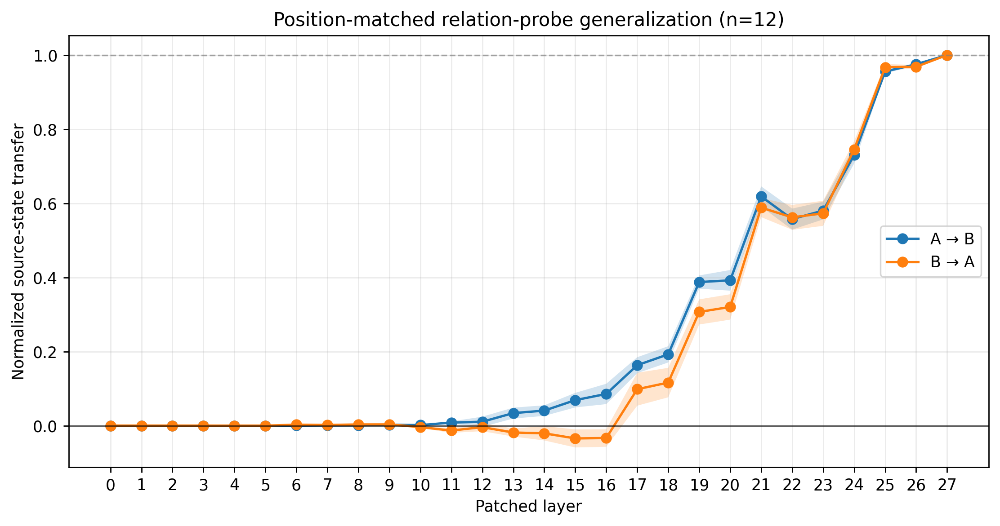

# Reasoning causal tracing

Small mechanistic-interpretability experiments on whether Qwen3-0.6B's verbalized reasoning tracks computations that influence its answer.

## Notebooks

- `notebooks/`: research process and experimental record.
  - `01_model_and_toy_sanity_check.ipynb`: model and behavioral checks.
  - `02_causal_localization.ipynb`: input-relation localization and controls.
  - `03_cot_causal_alignment.ipynb`: CoT interventions and controlled relation probe.
- `src/`: standalone reproductions of the main controlled experiments.

The strongest controlled result holds the prompt and teacher-forced continuation text fixed, changes only a layer-3 prompt state during prefill, and patches the residual stream at the same probe position. The clean and corrupted-state baselines favor opposite relation tokens; causal separation becomes clear in later layers. This result concerns an internal prompt-state intervention and does not establish that verbalized CoT is necessary.

The position-matched result was repeated across 21 candidate name permutations. **12 / 21 qualified** under the fixed behavioral and probe criteria; all nine rejections failed the required clean behavioral contrast. Across the qualified examples, bidirectional source-state transfer became consistent in later layers, reached approximately 0.96 by layer 25, and was complete immediately before the readout at layer 27.



## Run

From the repository root:

```bash
pip install -r requirements.txt
python main.py
```

The default is the position-matched relation probe. Experiments can also be run directly:

```bash
python main.py --experiment relation-probe
python main.py --experiment localization
python main.py --experiment generalization
python src/position_matched_relation_probe.py
python src/causal_localization.py
python src/position_matched_generalization.py
```

The first run downloads `Qwen/Qwen3-0.6B` and requires enough memory for model activations.
The generalization run is substantially more expensive than the default single-example experiment.

## Reproducibility

Experiments use fixed seeds and deterministic decoding where generation is involved. GPU kernels and library versions can still introduce small numerical differences; the identity controls provide an implementation check.
